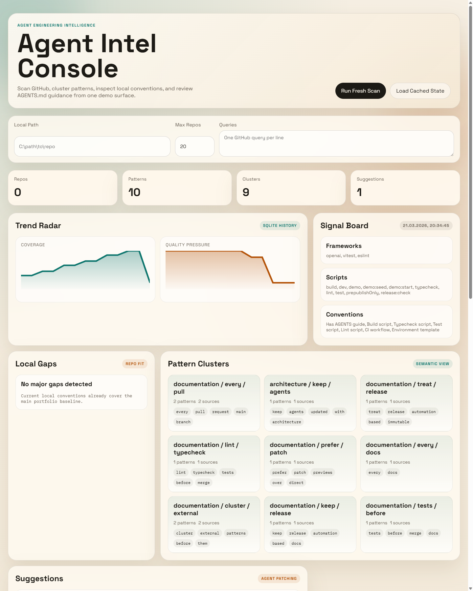
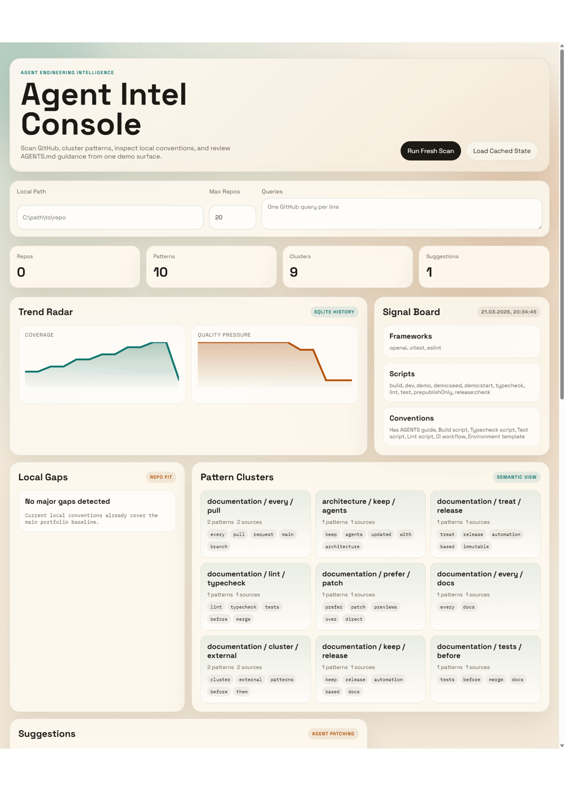

# agent-intel-mcp

`agent-intel-mcp` is an OpenAI-powered developer intelligence MCP server. It scans high-signal GitHub repositories, extracts reusable agent-engineering patterns, clusters them, compares them against a local codebase, and proposes safe `AGENTS.md` improvements.

This version moves beyond a thin MVP:

- Deep local codebase scanning with conventions and gap detection
- OpenAI `Responses API` for suggestion synthesis
- OpenAI embeddings for pattern clustering with heuristic fallback
- MCP stdio server with tools, resources, and prompts
- GitHub repository scanning with relevance scoring
- `AGENTS.md` patch preview generation
- SQLite-backed local memory for scans, clusters, suggestions, and dashboard history
- CI, release, and deploy scaffolding for portfolio-ready delivery

## What This Project Proves

- OpenAI integration beyond chat wrappers
- MCP server design for agent clients
- GitHub mining and local repo analysis in one workflow
- safe patch generation instead of blind repository mutation
- TypeScript developer tooling with tests, CI, and release scaffolding

## Demo Preview





## Architecture

```text
+---------------------------------------------------------------+
| agent-intel-mcp                                               |
|                                                               |
|  MCP Server (stdio)                                           |
|  |- Tools: scan, extract, cluster, analyze, suggest, patch    |
|  |- Resources: scans, patterns, clusters, local profile, patch|
|  `- Prompts: summary, AGENTS rewrite                          |
|                                                               |
|  Core Engine                                                  |
|  |- GithubScanner          -> Octokit search + README fetch   |
|  |- PatternExtractor       -> heuristic pattern mining        |
|  |- PatternClusterer       -> embeddings / cosine clustering  |
|  |- LocalRepoProfiler      -> codebase conventions + gaps     |
|  |- OpenAiSuggestionEngine -> Responses API / heuristic mode  |
|  |- PatchBuilder           -> non-destructive AGENTS diff     |
|  `- SqliteStore            -> scans, patterns, clusters       |
+---------------------------------------------------------------+
```

More detail: [docs/ARCHITECTURE.md](/C:/Users/syfsy/projekty/agent-intel-mcp/docs/ARCHITECTURE.md)
Case study: [docs/CASE_STUDY.md](/C:/Users/syfsy/projekty/agent-intel-mcp/docs/CASE_STUDY.md)

## Tools

- `scan_github_repos`
- `extract_patterns`
- `cluster_patterns`
- `analyze_local_repo`
- `generate_suggestions`
- `generate_agents_patch`

## Quick Start

```bash
npm install
cp .env.example .env
npm run build
npm test
npm run demo:seed
npm run demo
```

Open [http://localhost:4321](http://localhost:4321).

## Run With `.env`

Create a local `.env` in the project root:

```env
OPENAI_API_KEY=sk-...
GITHUB_TOKEN=ghp_...
LOCAL_REPO_PATH=C:\Users\syfsy\projekty\agent-intel-mcp
```

Then run:

```bash
npm install
npm run build
npm run demo
```

Use `.env` when you want real OpenAI-backed suggestions or a different local repository target.

## Run Demo Against Another Repo

PowerShell example:

```powershell
$env:LOCAL_REPO_PATH="C:\Users\syfsy\projekty\some-other-repo"
npm run demo
```

Or put that path into `.env`:

```env
LOCAL_REPO_PATH=C:\Users\syfsy\projekty\some-other-repo
```

What changes in this mode:

- local stack analysis points at the other repo
- detected gaps and conventions come from the other repo
- generated `AGENTS.md` patch is tailored to the other repo

## Connect As An MCP Server

Build first:

```bash
npm install
npm run build
```

Then add it to your MCP client config:

```json
{
  "mcpServers": {
    "agent-intel": {
      "command": "node",
      "args": ["C:/Users/syfsy/projekty/agent-intel-mcp/dist/index.js"],
      "env": {
        "OPENAI_API_KEY": "sk-...",
        "GITHUB_TOKEN": "ghp_...",
        "LOCAL_REPO_PATH": "C:/Users/syfsy/projekty/agent-intel-mcp"
      }
    }
  }
}
```

After restart, the MCP client will see these tools:

- `scan_github_repos`
- `extract_patterns`
- `cluster_patterns`
- `analyze_local_repo`
- `generate_suggestions`
- `generate_agents_patch`

## Environment

| Variable | Default | Description |
| --- | --- | --- |
| `OPENAI_API_KEY` | unset | Enables model-backed suggestions and embeddings |
| `OPENAI_MODEL` | `gpt-5-mini` | OpenAI model used for suggestion generation |
| `OPENAI_EMBEDDING_MODEL` | `text-embedding-3-small` | Model used for pattern clustering |
| `GITHUB_TOKEN` | unset | Raises GitHub API limits and private-org access |
| `CLUSTER_SIMILARITY_THRESHOLD` | `0.82` | Cosine threshold for embedding-based clusters |
| `LOCAL_REPO_PATH` | `process.cwd()` | Repository profiled for AGENTS.md suggestions |
| `AGENT_INTEL_DATA_DIR` | `.agent-intel` | SQLite and cached outputs |

## Demo UX

- Local dashboard served from `http://localhost:4321`
- Real pipeline trigger: fresh scan, clustering, local gap analysis, patch preview, and history charts
- Seeded portfolio state via `npm run demo:seed`
- Safe patch preview keeps suggested `AGENTS.md` changes reviewable before any adoption
- Frontend files: [public/index.html](/C:/Users/syfsy/projekty/agent-intel-mcp/public/index.html), [public/styles.css](/C:/Users/syfsy/projekty/agent-intel-mcp/public/styles.css), [public/app.js](/C:/Users/syfsy/projekty/agent-intel-mcp/public/app.js)

## Release Readiness

- CI: [ci.yml](/C:/Users/syfsy/projekty/agent-intel-mcp/.github/workflows/ci.yml)
- Tagged release publishing: [release.yml](/C:/Users/syfsy/projekty/agent-intel-mcp/.github/workflows/release.yml)
- Package validation: `npm run release:check`

## Deploy Preview

The repo ships with Docker and Render scaffolding:

- [Dockerfile](/C:/Users/syfsy/projekty/agent-intel-mcp/Dockerfile)
- [render.yaml](/C:/Users/syfsy/projekty/agent-intel-mcp/render.yaml)

Recommended path:

1. Push the repo to GitHub.
2. Create a Render web service from the repo.
3. Add `OPENAI_API_KEY` and `GITHUB_TOKEN` if you want live model-backed scans.
4. Use `/healthz` as the health check.
5. Deploy and open the generated public URL as the portfolio preview.

## Why OpenAI Here

This implementation uses the OpenAI `Responses API` for suggestion synthesis and the embeddings API for semantic clustering. Current official docs also describe tool-driven workflows and remote MCP support: [Using tools](https://developers.openai.com/api/docs/guides/tools) and [Developer quickstart](https://developers.openai.com/api/docs/quickstart).
